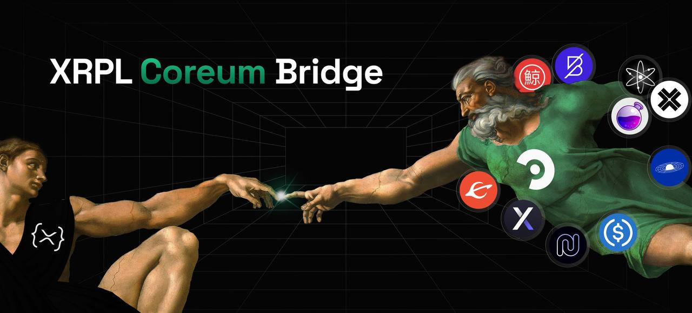

# Token Registry for XRPL-Coreum Bridge

## Overview
This repository is an open-source initiative designed to facilitate the registration of tokens from the XRPL, Coreum, and Cosmos ecosystems for use on the XRPL-Coreum Bridge. The registry supports tokens on Devnet, Testnet, and Mainnet environments.




## Supported Networks
- **XRPL**: XRP Ledger
- **Coreum**: Coreum Blockchain
- **Cosmos**: Cosmos Ecosystem

## Repository Structure
- `/assets.json`: Primary file containing specifications for token registration.
- `/docs`: Documentation on the token registration process and guidelines.
- `/scripts`: Contains scripts for validating the pull requests and automating the merge process.

## Adding a New Token
To register a new token, follow these steps:

### Step 1: Choose the Environment
Select the appropriate environment for the token: Devnet, Testnet, or Mainnet.

### Step 2: Fork the Repository
Fork this repository to your own GitHub account to begin making your changes.

### Step 3: Create Your Token JSON Entry
Add your token information following the specifications outlined in the `assets.json` file. Ensure that your data conforms to the structured format required.

### Step 4: Create a Pull Request
Submit your changes as a pull request (PR) to the main repository. The PR should follow the standard template provided and include a thorough description of the token and its functionalities.

## Examples
Here are examples of how to structure your JSON entries for token registration:

### XRPL Originated Asset
```json
{
  "denom": "xrpl272320ca43-testcore1672us3f65wz6rlxse58ea4u3092gh7y34e0a9cwl4g6uvuerzvjsvarmea",
  "description": "SOLO from XRPL",
  "ibc_info": {},
  "logo_URIs": {
    "png": "https://raw.githubusercontent.com/CoreumFoundation/token-registry/master/files/solo/images/solo.png",
    "svg": "https://raw.githubusercontent.com/CoreumFoundation/token-registry/master/files/solo/images/solo.svg"
  },
  "urls": {},
  "social_media": {},
  "extra": {
    "xrpl_info": {
      "precision": 15,
      "source_chain": "XRPL",
      "issuer": "rHZwvHEs56GCmHupwjA4RY7oPA3EoAJWuN",
      "currency": "534F4C4F00000000000000000000000000000000"
    }
  }
}


### Coreum / Cosmos Originated Asset - OSMO from Osmosis
The following JSON structure represents the essential metadata for OSMO as it is used across networks:
```json
{
  "denom": "ibc/404D5E758F6BF8FAA23395A66D357176696560A78BF057EFCE133D1B8C4FB1A3",
  "description": "OSMO from Osmosis",
  "ibc_info": {
    "display_name": "OSMO",
    "precision": 6,
    "source_chain": "Osmosis"
  },
  "logo_URIs": {
    "png": "https://raw.githubusercontent.com/CoreumFoundation/token-registry/master/files/osmosis/images/osmo.png",
    "svg": "https://raw.githubusercontent.com/CoreumFoundation/token-registry/master/files/osmosis/images/osmo.svg"
  },
  "urls": {
    "website": "https://osmosis.zone",
    "github": "https://github.com/osmosis-labs/osmosis",
    "whitepaper": "https://medium.com/osmosis/vision-for-osmosis-e68e796ff1c2"
  },
  "social_media": {
    "twitter": "https://twitter.com/osmosiszone",
    "discord": "https://discord.com/invite/osmosis"
  },
  "extra": {
    "ibc_info": {
      "display_name": "OSMO",
      "precision": 6,
      "source_chain": "Osmosis",
      "denom": "uosmo"
    }
  }
}
